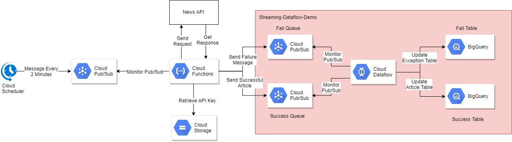

# Dataflow Streaming Demo

## Background

The purpose of this demo is to demonstrate the Dataflow’s streaming capability. It references news data provides by News API and feeds the unbounded data to Big Query table. Any error that occurs upstream (i.e. from accessing the API or the cloud function) or within the dataflow pipeline itself will be collected in a seperated table.

### News API

News API is a simple and easy-to-use API that returns JSON metadata for headlines and articles live all over the web right now. For this demo, the developer model was chosen; this model is restricted to 1000 messages per day.

For more details about News API, please reference https://newsapi.org/

## Google Cloud Services Utilized
* Cloud Scheduler
* Cloud Function
* Cloud Pub/Sub
* Cloud Dataflow
* Cloud BigQuery
* Cloud Storage
* Cloud Identity and Access Management (IAM)

## Architecture

The entire streaming architecture is decoupled into two main segmenets.  The Cloud Function [LINK TO REPO] handles the News API call and parses the nested response into the Pub/Sub.  The Datflow ingests 

